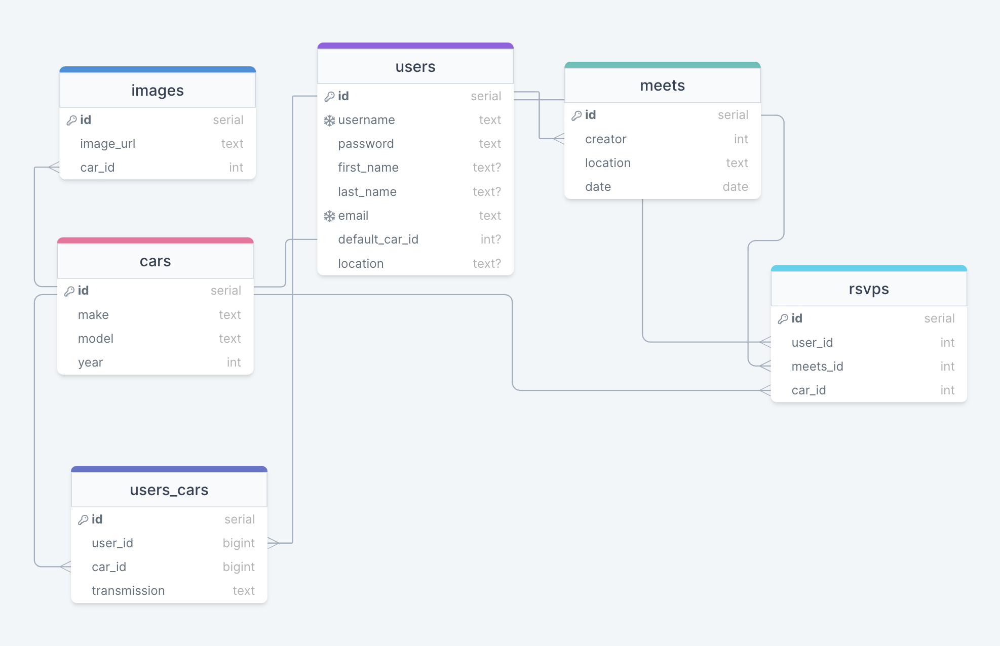

# Capstone Project 1 Proposal
## RevUp.com
**A location for car enthusiests to schedule/create car meets and rsvp to attend a meet.**

## Tech Stack

### Front End
- HTML
- CSS
- JavaScript
- JQuery

### BackEnd
- Postgresql
- Python
- Flask
- SQLAlchemy
- WTForms
- Jinja

### Testing
- Jasmine for front end
- Unittest for back end

## Front-end or Back-End?
I will use back-end mostly in order to do most of the heavy lifting and management but javascript will be used in order to make the site more smooth and interactable as well as for the settings page.

## Website or other medium?
I will be creating a website. The backend focus will allow for easier translation to other mediums in the future after this project such as a mobile app which would add great convenience for the user. 

## Goal
The goal is to make it more convenient for car enthusiests to find and attend meets as well as make getting into the car scene more accessible for new enthusiests.

## Demographic
Car enthusiests of any age!

## DATA/API
I will be using location data in order to plan the meets locations as well as car make and model data for the planned personal garage feature. My current main option is the [api ninjas car api](https://api-ninjas.com/api/cars). For the location api my current choice is mapquest.

## Approach
### Database Schema

### Issues
It might be difficult to convert my locations into storable data for my database. 

### Sensitive Info?
I will need to secure the users passwords.

##Stretch Goal
Be an active website for users to post their meets and expand their reach!